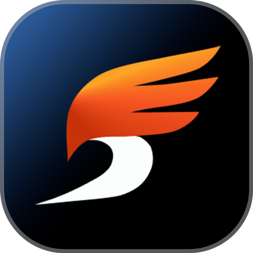
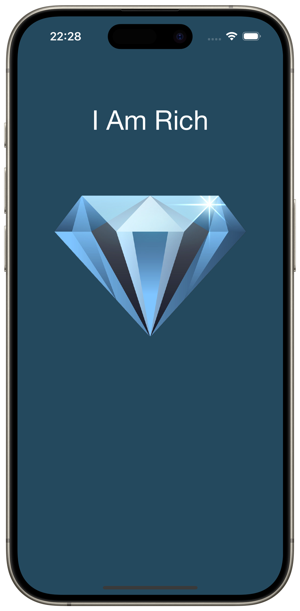
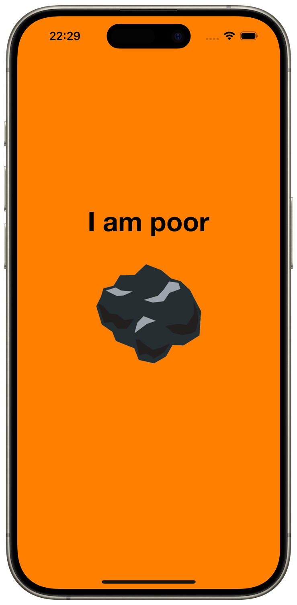
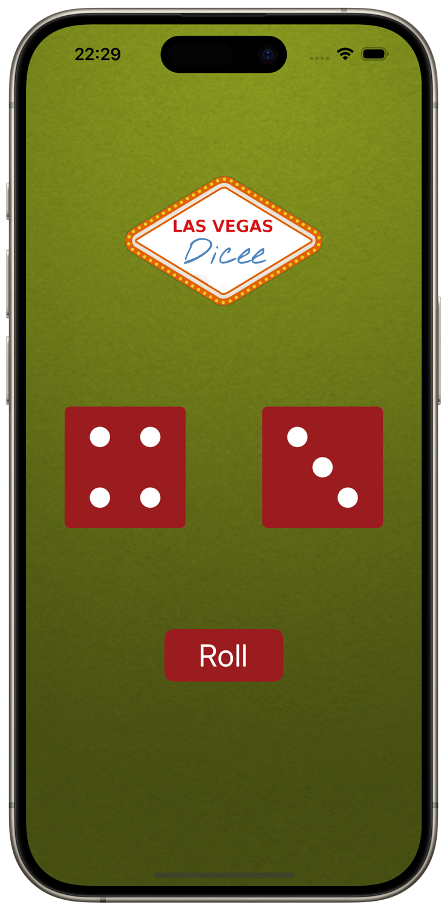
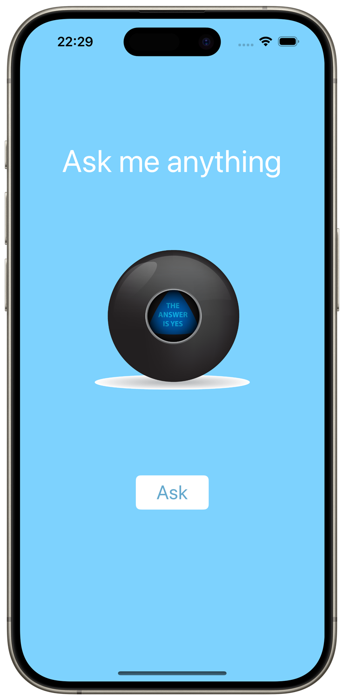
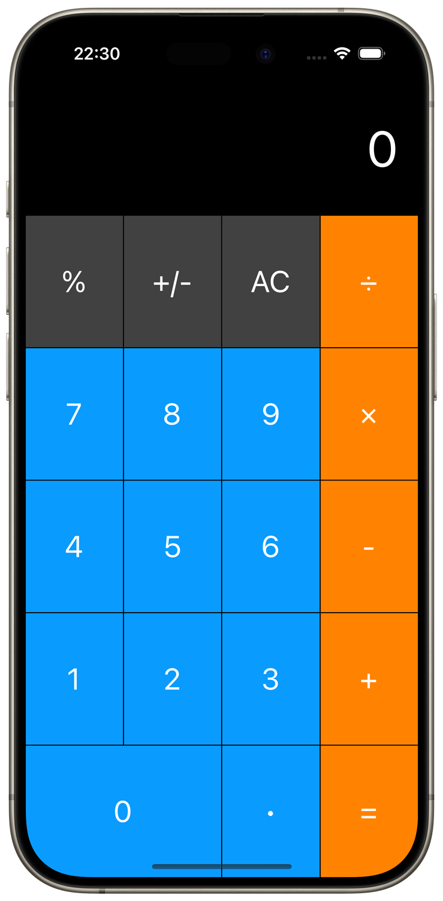

  <table>
    <tr>
      <td>
        
      </td>
      <td>
        <h1><a href="https://swiftmarathon.devrush.ru">Swift Matathon X</a></h1>
        
An educational Swift marathon with teamwork challenges, based on Angela's Yu iOS App Development course.

      </td>
    </tr>
  </table>

## Technologies
- [x] UIKit
- [x] Storyboards

## Screenshots
    

## Contact me
[LinkedIn](https://www.linkedin.com/in/bytepixelmelody "https://www.linkedin.com/in/bytepixelmelody") | [Telegram](https://t.me/bytepixelmelody "@bytepixelmelody") | [Email](mailto:bytepixelmelody@gmail.com "bytepixelmelody@gmail.com")